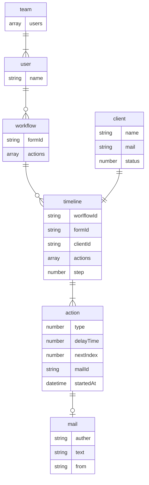

```mermaid
  erDiagram
  timeline {
    string worlflowId
    string formId
    string clientId
    array actions
    number step
  }

  action {
    number type
    number delayTime
    number nextIndex
    string mailId
    datetime startedAt
  }

  workflow {
    string formId
    array actions
  }

  client {
    string name
    string mail
    number status
  }

  team {
    array users
  }

  user {
    string name
  }

  mail {
    string auther
    string text
    string from
  }

  team ||--|{ user: ""
  user ||--o{ workflow: ""
  workflow ||--o{ timeline: ""
  client ||--|| timeline: ""
  timeline ||--|{ action: ""
  action ||--o| mail: ""
```
