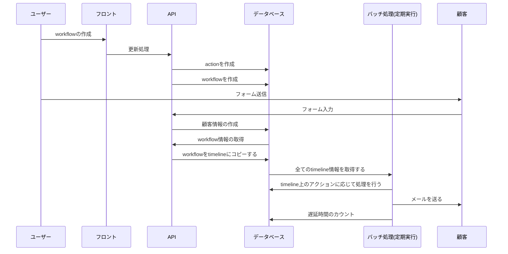

```mermaid
sequenceDiagram
participant user as ユーザー
participant front as フロント
participant api as API
participant db as データベース
participant batch as バッチ処理(定期実行)
participant client as 顧客

  user ->> front: workflowの作成
  front ->> api: 更新処理
  api ->> db: actionを作成
  api ->> db: workflowを作成
  user ->> client: フォーム送信
  client ->> api: フォーム入力
  api ->> db: 顧客情報の作成
  db ->> api: workflow情報の取得
  api ->> db: workflowをtimelineにコピーする
  db ->> batch: 全てのtimeline情報を取得する
  batch ->> db: timeline上のアクションに応じて処理を行う
  batch ->> client: メールを送る
  batch ->> db: 遅延時間のカウント

```
